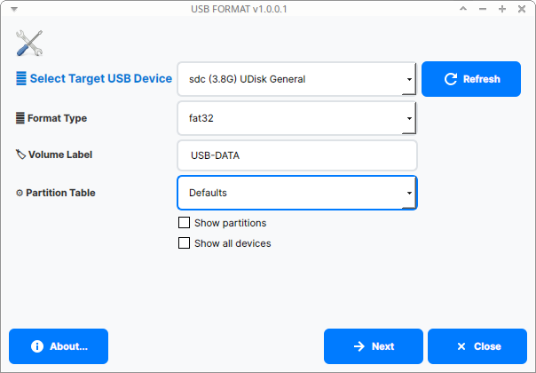

# FormatUSB v1.1.0

[](https://www.gnu.org/licenses/gpl-3.0)
[](https://github.com/dezuuu12/FormatUSB)
[](https://github.com/dezuuu12/FormatUSB)

**FormatUSB** is a modern, powerful graphical tool for formatting USB drives and removable storage devices on Linux systems. Built with Qt5/6 and C++20, it provides an intuitive, safe, and user-friendly interface for formatting USB drives with various filesystem options.



> **Important Note**: FormatUSB is a **Linux desktop application** that requires an X11/Wayland display server, root privileges, and physical USB hardware access. While the code can be developed and compiled in cloud environments (like Replit), the application must be run on a local Linux system with physical USB devices.

---

## 📋 Table of Contents

- [Features](#-features)
- [System Requirements](#-system-requirements)
- [Installation](#-installation)
  - [Pre-built Binary](#method-1-pre-built-binary)
  - [Build from Source](#method-2-build-from-source)
  - [Automatic Installation](#automatic-installation-with-installsh)
- [Usage](#-usage)
- [Supported Filesystems](#-supported-filesystems)
- [Safety Features](#%EF%B8%8F-safety-features)
- [Building and Development](#-building-and-development)
- [Troubleshooting](#-troubleshooting)
- [Project Structure](#%EF%B8%8F-project-structure)
- [Changelog](#-changelog)
- [Contributing](#-contributing)
- [License](#-license)
- [Credits](#-credits)

---

## ✨ Features

- **🎨 Modern GUI**: Clean, contemporary design with intuitive controls
- **💾 Multiple Filesystem Support**: 
  - **FAT32** - Universal compatibility (Windows/Mac/Linux/Android)
  - **NTFS** - Windows native with large file support
  - **ext4** - Linux native with optimal performance
  - **exFAT** - Cross-platform with large file support
- **🔍 Automatic Device Detection**: Intelligent USB device detection with multiple methods
- **🛡️ Advanced Safety Features**: 
  - System drive protection to prevent accidental formatting
  - Removable device filtering
  - Confirmation dialogs before destructive operations
- **⚙️ Partition Table Options**: Support for GPT, MBR/MSDOS, and automatic selection
- **🏷️ Custom Volume Labels**: Set custom names for your drives with filesystem-specific validation
- **🌍 Internationalization**: Supports 50+ languages
- **📦 Embedded Resources**: CHANGELOG and assets bundled directly in the binary
- **⚡ Fast & Efficient**: Multi-threaded device detection and formatting

---

## 🖥️ System Requirements

### Supported Operating Systems

| Distribution | Minimum Version | Status |
|--------------|----------------|--------|
| Ubuntu | 18.04 LTS | ✅ Tested |
| Debian | 9 (Stretch) | ✅ Tested |
| Linux Mint | 19 | ✅ Compatible |
| Elementary OS | 5.0 | ✅ Compatible |
| Pop!_OS | 20.04 | ✅ Compatible |
| Fedora | 30+ | ✅ Compatible |
| Arch Linux | Latest | ✅ Compatible |
| Other Debian-based | - | ⚠️ Should work |

### Hardware Requirements

- **RAM**: Minimum 512 MB (Recommended: 1 GB+)
- **Disk Space**: 10 MB for application
- **Display**: X11 or Wayland display server
- **USB Port**: For devices to be formatted

### Software Dependencies

**Required:**
- Qt5 ≥ 5.9 or Qt6 (Core, GUI, Widgets modules)
- C++ Compiler with C++20 support (GCC 7+, Clang 10+)
- X11 or Wayland display server
- Root/sudo privileges for formatting operations

**System Tools:**
- `parted` - Partition table manipulation
- `lsblk` - Block device listing
- `udevadm` - Device information (optional, fallback)

**Filesystem Tools (install as needed):**
- `mkfs.vfat` (dosfstools) - For FAT32
- `mkfs.ntfs` (ntfs-3g) - For NTFS
- `mkfs.ext4` (e2fsprogs) - For ext4
- `mkfs.exfat` (exfatprogs or exfat-utils) - For exFAT

---

## 📦 Installation

### Method 1: Pre-built Binary

**Download the latest release:**

```bash
# Download from GitHub Releases
wget https://github.com/dezuuu12/FormatUSB/releases/download/v1.1.0/formatusb

# Make it executable
chmod +x formatusb

# Run
sudo ./formatusb
```

### Method 2: Build from Source

#### Step 1: Install Build Dependencies

**Ubuntu/Debian/Linux Mint:**
```bash
# Update package lists
sudo apt update

# Install build tools and Qt5
sudo apt install -y \
    build-essential \
    gcc \
    g++ \
    make \
    qtbase5-dev \
    qtchooser \
    qt5-qmake \
    qtbase5-dev-tools \
    pkg-config \
    git

# Install system utilities
sudo apt install -y \
    parted \
    dosfstools \
    ntfs-3g \
    e2fsprogs

# Install exFAT support (choose one)
# For modern systems (Ubuntu 20.04+, Debian 11+):
sudo apt install -y exfatprogs

# Or for older systems (Ubuntu 18.04, Debian 9-10):
sudo apt install -y exfat-fuse exfat-utils
```

**Fedora/RHEL/CentOS:**
```bash
sudo dnf install -y \
    gcc \
    gcc-c++ \
    make \
    qt5-qtbase-devel \
    git \
    parted \
    dosfstools \
    ntfs-3g \
    e2fsprogs \
    exfatprogs
```

**Arch Linux:**
```bash
sudo pacman -S --needed \
    base-devel \
    qt5-base \
    git \
    parted \
    dosfstools \
    ntfs-3g \
    e2fsprogs \
    exfatprogs
```

**Verify Dependencies:**
```bash
# Check Qt5 installation
qmake --version
# Expected: QMake version 3.x, Using Qt version 5.x

# Check compiler
g++ --version
# Expected: g++ 7.0 or newer

# Check system tools
parted --version
lsblk --version
```

#### Step 2: Clone Repository

```bash
# Clone from GitHub
git clone https://github.com/dezuuu12/FormatUSB.git

# Enter project directory
cd FormatUSB
```

#### Step 3: Build Application

```bash
# Generate Makefile with qmake
qmake src.pro

# Compile with make (use multiple cores for speed)
make -j$(nproc)

# Result: 'formatusb' executable will be created in current directory
```

**Expected Output:**
```
...
g++ -Wl,-O1 -o formatusb main.o mainwindow.o about.o cmd.o ...
```

#### Step 4: Verify Build

```bash
# Check executable file
ls -lh formatusb
# Expected: -rwxr-xr-x ... 160K ... formatusb

# Check version
./formatusb --version
# Expected output: Version: 1.1.0
```

### Automatic Installation with `install.sh`

If you don't want to do manual installation steps, use the provided installation script:

```bash
# Make sure FormatUSB is built first
make

# Run the installer
sudo ./install.sh
```

This will automatically:
- Copy the binary to `/usr/local/bin`
- Copy required libraries to `/usr/lib/formatusb` and `/usr/local/lib/formatusb`
- Install icons and desktop entry
- Update the desktop database

⚠️ **Note**: You must first compile the project (`make` to generate `formatusb`) before running `install.sh`.

**Verify Installation:**

```bash
which formatusb
# Expected: /usr/local/bin/formatusb

formatusb --version
# Expected: Version: 1.1.0
```

---

## 🚀 Usage

### Running the Application

**From Source Directory:**
```bash
# Run directly from build folder
sudo ./formatusb
```

**If Installed System-Wide:**
```bash
# Run from terminal
sudo formatusb

# Or find in application menu: System → FormatUSB
```

**Important Notes:**
- ⚠️ Application requires **root privileges** for formatting operations
- If prompted for password, enter your user password
- Use polkit/pkexec for automatic privilege escalation

### Step-by-Step Formatting Guide

#### 1️⃣ Preparation
1. Connect the USB drive you want to format
2. **⚠️ BACKUP ALL IMPORTANT DATA** from the USB drive
3. Launch FormatUSB application (`sudo formatusb`)

#### 2️⃣ Select Target Device
1. In the "Select Target USB Device" dropdown, choose the correct device
2. **⚠️ CHECK CAREFULLY** - ensure you select the right USB device!
3. **Tip**: Check the capacity and device name to verify it's your USB drive

**Additional Options:**
- ☑️ **Show all devices** - Display all storage devices (⚠️ **DANGER!** Can show internal drives)
- ☑️ **Show partitions** - Display individual partitions instead of whole devices

#### 3️⃣ Choose Filesystem Format

| Format | Max File Size | Max Volume Size | Compatibility | Best Use Case |
|--------|---------------|-----------------|---------------|---------------|
| **FAT32** | 4 GB | 2 TB | Windows/Mac/Linux/Android | USB for small files, maximum compatibility |
| **NTFS** | 16 TB | 256 TB | Windows/Linux (read-only on Mac) | Windows USB, large files (>4GB) |
| **ext4** | 16 TB | 1 EB | Linux only | Linux-only USB, best performance |
| **exFAT** | 16 EB | 128 PB | Modern Windows/Mac/Linux | Modern cross-platform USB, large files |

**Recommendations:**
- 💾 **General purpose, maximum compatibility**: FAT32 (if all files < 4GB)
- 🎥 **Large videos, ISOs, archives**: exFAT or NTFS
- 🐧 **Linux-only usage**: ext4 (best performance)
- 🪟 **Windows-only usage**: NTFS

#### 4️⃣ Set Partition Table Options

- **Defaults** - Let the system choose automatically (recommended for most users)
- **MBR/msdos** - Compatible with old BIOS and legacy systems
- **GPT** - Modern standard, recommended for drives > 2TB

#### 5️⃣ Customize Volume Label (Optional)
- Enter a custom name for your USB drive
- Allowed characters vary by filesystem:
  - **FAT32**: A-Z, 0-9, _, - (max 11 characters)
  - **NTFS**: A-Z, 0-9, _, ., -, space (max 32 characters)
  - **ext4**: A-Z, 0-9, _, ., - (max 16 characters)
  - **exFAT**: A-Z, 0-9, _, ., -, space (max 15 characters)
- Examples: `MYUSB`, `Backup_2025`, `Data Drive`

#### 6️⃣ Format the Drive
1. Click the **"Next"** button
2. **⚠️ CONFIRM** the operation in the warning dialog
3. Wait for the formatting process to complete (progress shown in output log)
4. Check the output log for any errors
5. **✅ SUCCESS!** - Safely eject the USB drive when complete

---

## 💾 Supported Filesystems

### FAT32 (vfat)
- **Pros**: Universal compatibility, works on all operating systems
- **Cons**: 4 GB file size limit, 2 TB volume limit
- **Use Case**: USB drives for transferring small files between different systems

### NTFS
- **Pros**: Large file support, native Windows filesystem, journaling
- **Cons**: Limited Mac support (read-only without additional software)
- **Use Case**: Windows-centric environments, large files

### ext4
- **Pros**: Best performance on Linux, journaling, large file support
- **Cons**: Not natively supported on Windows/Mac
- **Use Case**: Linux-only USB drives, backup drives

### exFAT
- **Pros**: Modern cross-platform support, large file support, no 4GB limit
- **Cons**: Requires modern OS versions
- **Use Case**: Modern cross-platform USB drives, large media files

---

## 🛡️ Safety Features

### Data Loss Warning
- ❌ **Formatting PERMANENTLY DESTROYS all data** on the selected drive
- ❌ **Deleted data CANNOT be recovered**
- ✅ **Always backup important data** before formatting
- ✅ **Double-check device selection** before confirming

### Built-in Protection Mechanisms
1. **🛡️ System Drive Protection** - Automatically prevents formatting of system drives (root `/` and boot partitions)
2. **🛡️ Removable Device Filtering** - Only shows removable/USB devices by default
3. **🛡️ Multiple Confirmation Dialogs** - Requires explicit confirmation before destructive operations
4. **🛡️ Device Verification** - Uses multiple methods to verify USB devices (lsblk, udevadm, /sys/block)
5. **🛡️ Process Monitoring** - Logs all operations for debugging and verification

### Best Practices
1. ✅ Always verify device selection before formatting
2. ✅ Backup important data before any formatting operation
3. ✅ Test the USB drive after formatting by copying test files
4. ✅ Never unplug the USB drive during formatting
5. ✅ Use "Show all devices" option only when absolutely necessary
6. ✅ Safely eject the USB drive after formatting completes

---

## 🛠️ Building and Development

### Build System
- **Build Tool**: qmake (Qt Meta-Object Compiler)
- **Compiler**: GCC 7+ or Clang 10+ with C++20 support
- **Qt Version**: Qt5 (5.9+) or Qt6

### Build Commands

```bash
# Clean previous build
make clean

# Generate Makefile
qmake src.pro

# Build (parallel)
make -j$(nproc)

# Build (single-threaded for debugging)
make

# Clean everything including generated files
make distclean
```

### Development Dependencies

```bash
# Install development tools
sudo apt install -y \
    git \
    valgrind \
    gdb \
    qtcreator \
    clang-format
```

### Code Style
- Follow Qt coding conventions
- Use modern C++20 features where appropriate
- Add comments for complex logic
- Keep functions focused and single-purpose

---

## 🔧 Troubleshooting

### Problem 1: Permission Denied

**Error:**
```
Error: Permission denied
Cannot access /dev/sdb
```

**Solution:**
```bash
# Run with sudo
sudo ./formatusb

# Or if installed system-wide
sudo formatusb
```

### Problem 2: Qt Library Not Found

**Error:**
```
error while loading shared libraries: libQt5Core.so.5
```

**Solution:**
```bash
# Install Qt5 runtime libraries
sudo apt install -y qtbase5-dev libqt5widgets5 libqt5gui5 libqt5core5a

# Or install Qt5 full
sudo apt install -y qt5-default  # For older Ubuntu/Debian
```

### Problem 3: Device Not Detected

**Symptoms:** Device dropdown is empty or USB doesn't appear

**Solution:**

1. **Check USB Connection:**
   ```bash
   # List all block devices
   lsblk
   
   # Check USB devices
   lsusb
   
   # Check system log for USB events
   sudo dmesg | tail -20
   ```

2. **Try Different USB Port**

3. **Enable "Show all devices"** (⚠️ Be careful!)

4. **Check udev rules:**
   ```bash
   ls -l /dev/sd*
   ```

### Problem 4: Formatting Fails

**Error:**
```
Error: Failed to create filesystem
```

**Solution:**

1. **Unmount device first:**
   ```bash
   # Check mounted partitions
   mount | grep sdb
   
   # Unmount all partitions
   sudo umount /dev/sdb*
   ```

2. **Verify filesystem tools are installed:**
   ```bash
   # Check available mkfs tools
   ls /sbin/mkfs.*
   
   # Install missing tools
   sudo apt install dosfstools ntfs-3g e2fsprogs exfatprogs
   ```

3. **Check device for errors:**
   ```bash
   # Check device status
   sudo parted /dev/sdb print
   
   # Check for bad blocks (warning: slow!)
   sudo badblocks -v /dev/sdb
   ```

### Problem 5: Build Errors

**Error during compilation:**

**Solution:**
```bash
# Clean build artifacts
make clean
rm -f Makefile moc_* ui_* qrc_*

# Regenerate Makefile
qmake src.pro

# Rebuild
make -j$(nproc)
```

**Missing Qt headers:**
```bash
# Install all Qt5 development packages
sudo apt install -y qtbase5-dev qtbase5-dev-tools qt5-qmake
```

### Log Files

Application logs are saved to:
```
/tmp/formatusb.log
```

For debugging, monitor the log file in real-time:
```bash
tail -f /tmp/formatusb.log
```

---

## 🗂️ Project Structure

```
FormatUSB/
├── src.pro                 # Qt project configuration file
├── Makefile               # Generated by qmake (after build)
├── formatusb              # Compiled executable (after build)
│
├── main.cpp               # Application entry point
├── mainwindow.cpp         # Main window logic
├── mainwindow.h           # Main window header
├── mainwindow.ui          # Qt Designer UI file (GUI layout)
├── about.cpp              # About dialog implementation
├── about.h                # About dialog header
├── cmd.cpp                # Command execution wrapper
├── cmd.h                  # Command execution header
├── version.h              # Version definitions (1.1.0)
│
├── images.qrc             # Qt resource file (embedded assets)
├── CHANGELOG.txt          # Application changelog (embedded in binary)
├── README.md              # This file - User documentation
├── LICENSE                # GPL v3 License
│
├── lib/
│   └── formatusb_lib      # Core formatting library (Bash script)
│
├── images/
│   ├── FORMAT.png         # Screenshot
│   └── logo.svg           # Application logo
│
├── translations/          # Internationalization files
│   ├── formatusb_en.ts    # English
│   ├── formatusb_id.ts    # Indonesian
│   ├── formatusb_de.ts    # German
│   ├── formatusb_fr.ts    # French
│   ├── formatusb_es.ts    # Spanish
│   ├── formatusb_zh_CN.ts # Chinese (Simplified)
│   ├── formatusb_ja.ts    # Japanese
│   └── ... (50+ languages)
│
├── debian/                # Debian packaging files
│   ├── changelog          # Debian changelog
│   ├── control            # Package dependencies
│   ├── copyright          # Copyright information
│   ├── install            # Installation rules
│   ├── rules              # Build rules
│   └── source/
│       └── format         # Source format
│
└── polkit-actions/        # PolicyKit rules
    └── org.usbformat.pkexec.formatusb.policy
```

---

## 📝 Changelog

### Version 1.1.0 (October 25, 2025)

**Major Update:**
- ✅ **Updated** copyright to danko12
- ✅ **Updated** repository URLs to https://github.com/dezuuu12/FormatUSB
- ✅ **Modernized** codebase with enhanced error handling
- ✅ **Improved** build system compatibility with Replit environment
- ✅ **Enhanced** comprehensive English documentation
- ✅ **Fixed** compilation warnings
- ✅ **Enhanced** USB device detection algorithm
- ✅ **Improved** user interface with modern styling
- ✅ **Better** safety checks for system drive protection

**Technical Improvements:**
- Enhanced multi-method USB device detection (lsblk, udevadm, /sys/block)
- Improved error handling in formatting library
- Modern C++20 features usage
- Better Qt5/Qt6 compatibility
- Cleaner code structure and organization

### Version 1.0.0.3 (October 03, 2025)

**Changes:**
- ➕ **Added** comprehensive health check script
- 📚 **Updated** documentation with detailed installation guide
- 🔧 **Improved** README with troubleshooting section
- 🌐 **Converted** all documentation to English

### Version 1.0.0.2 (October 03, 2025)

**Changes:**
- ➖ **Removed** license button from about dialog (cleaner UI)
- 📦 **Embedded** CHANGELOG.txt into application resources
- 🚀 **Improved** resource management and portability

### Version 1.0.0.1 (September 25, 2025)

**Changes:**
- 🎉 Initial release after fork from MX Linux FormatUSB
- 🔍 Enhanced USB detection
- 🎨 Modern GUI with compact design
- 📝 Updated copyright
- 🛠️ Improved error handling

---

## 🤝 Contributing

Contributions are welcome! Here's how you can help:

### Reporting Bugs

1. Open [GitHub Issues](https://github.com/dezuuu12/FormatUSB/issues)
2. Check if the bug is already reported
3. Create a new issue with:
   - **OS & Version**: Ubuntu 22.04, Debian 12, etc.
   - **Qt Version**: Output from `qmake --version`
   - **Steps to Reproduce**: Clear steps to trigger the bug
   - **Expected Behavior**: What should happen
   - **Actual Behavior**: What actually happens
   - **Logs**: Output from `/tmp/formatusb.log`
   - **Screenshots**: If applicable

### Contributing Code

1. **Fork** the repository
2. **Clone** your fork:
   ```bash
   git clone https://github.com/YOUR_USERNAME/FormatUSB.git
   ```
3. **Create feature branch**:
   ```bash
   git checkout -b feature/amazing-feature
   ```
4. **Make changes** and test thoroughly
5. **Commit** with descriptive messages:
   ```bash
   git commit -m "Add: Support for F2FS filesystem"
   ```
6. **Push** to your fork:
   ```bash
   git push origin feature/amazing-feature
   ```
7. **Create Pull Request** on GitHub

### Coding Standards

- Follow Qt coding conventions
- Use modern C++20 features where appropriate
- Add comments for complex logic
- Test on multiple Linux distributions
- Update documentation for user-facing changes
- Ensure code compiles without errors

---

## 📄 License

This project is licensed under **GNU General Public License v3.0**.

```
FormatUSB - USB Drive Formatting Tool
Copyright (C) 2025 danko12

This program is free software: you can redistribute it and/or modify
it under the terms of the GNU General Public License as published by
the Free Software Foundation, either version 3 of the License, or
(at your option) any later version.

This program is distributed in the hope that it will be useful,
but WITHOUT ANY WARRANTY; without even the implied warranty of
MERCHANTABILITY or FITNESS FOR A PARTICULAR PURPOSE. See the
GNU General Public License for more details.

You should have received a copy of the GNU General Public License
along with this program. If not, see <http://www.gnu.org/licenses/>.
```

See [LICENSE](LICENSE) file for complete details.

---

## 👥 Credits

### Current Maintainer
- **danko12** - Lead Developer & Maintainer

### Original Project
- **MX Linux Team** - Original FormatUSB implementation
- **James Bowlin (BitJam)** - live-usb-maker utilities

### Frameworks & Libraries
- **Qt Framework** - Excellent GUI toolkit
- **GNU Project** - Core utilities
- **Linux Kernel** - USB and block device support

---

## 📞 Support & Contact

- **GitHub Repository**: [https://github.com/dezuuu12/FormatUSB](https://github.com/dezuuu12/FormatUSB)
- **Issues & Bug Reports**: [GitHub Issues](https://github.com/dezuuu12/FormatUSB/issues)
- **Email**: formatusb1122@gmail.com

---

## ⭐ Show Your Support

If this project is useful to you, please give it a ⭐ on GitHub!

[](https://github.com/dezuuu12/FormatUSB)
[](https://github.com/dezuuu12/FormatUSB/fork)

---

**Made with ❤️ for the Linux community by danko12**

*FormatUSB is an open-source tool developed to make formatting USB drives on Linux safe, easy, and intuitive.*
